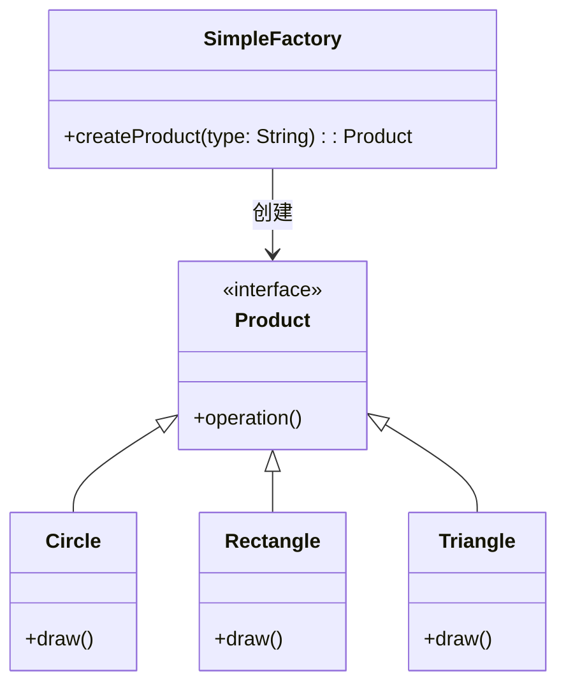
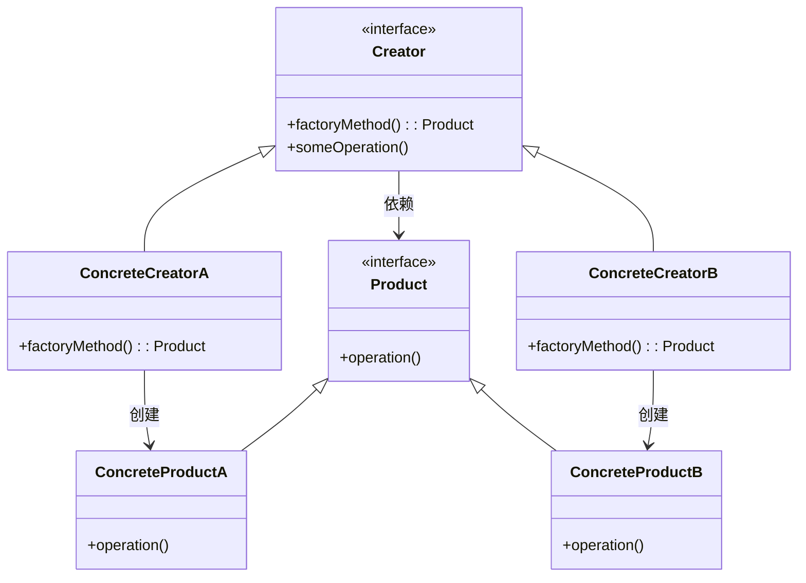

# 目录
- [目录](#目录)
- [简单工厂模式 (Simple Factory Pattern)](#简单工厂模式-simple-factory-pattern)
  - [定义](#定义)
  - [类图](#类图)
  - [代码示例](#代码示例)
  - [优点](#优点)
  - [缺点](#缺点)
- [工厂方法模式 (Factory Method Pattern)](#工厂方法模式-factory-method-pattern)
  - [定义](#定义-1)
  - [类图](#类图-1)
  - [代码示例](#代码示例-1)
  - [优点](#优点-1)
  - [缺点](#缺点-1)

# 简单工厂模式 (Simple Factory Pattern)

## 定义
简单工厂模式又称为静态工厂方法模式，它定义一个工厂类，根据传入的参数不同返回不同的产品实例。

## 类图


## 代码示例
```java
// 产品接口
public interface Shape {
    void draw();
}

// 具体产品
public class Circle implements Shape {
    @Override
    public void draw() {
        System.out.println("Circle.draw()");
    }
}

public class Rectangle implements Shape {
    @Override
    public void draw() {
        System.out.println("Rectangle.draw()");
    }
}

public class Triangle implements Shape {
    @Override
    public void draw() {
        System.out.println("Triangle.draw()");
    }
}

// 工厂类
public class ShapeFactory {
    public static Shape createShape(String shapeType) {
        if (shapeType == null) return null;
        return switch (shapeType.toLowerCase()) {
            case "circle" -> new Circle();
            case "rectangle" -> new Rectangle();
            case "triangle" -> new Triangle();
            default -> throw new IllegalArgumentException("Invalid shape type");
        };
    }
}

// 使用
public class SimpleFactoryDemo {
    public static void main(String[] args) {
        Shape circle = ShapeFactory.createShape("circle");
        Shape rectangle = ShapeFactory.createShape("rectangle");
        Shape triangle = ShapeFactory.createShape("triangle");

        circle.draw();
        rectangle.draw();
        triangle.draw();
    }
}
```

## 优点
1. 将对象的创建和使用分离
2. 客户端无需知道具体产品类名，只需知道参数
3. 通过引入配置文件，可以在不修改代码的情况下更换具体产品

## 缺点
1. 工厂类集中了所有产品的创建逻辑，职责过重
2. 增加新产品需要修改工厂类，违反开闭原则
3. 难以扩展复杂的产品等级结构

# 工厂方法模式 (Factory Method Pattern)

## 定义
工厂方法模式定义了一个创建对象的接口，但让子类决定要实例化的类是哪一个。工厂方法让类的实例化推迟到子类。

## 类图


## 代码示例
```java
// 产品接口
public interface Shape {
    void draw();
}

// 具体产品
public class Circle implements Shape {
    @Override
    public void draw() {
        System.out.println("Circle::draw()");
    }
}

public class Rectangle implements Shape {
    @Override
    public void draw() {
        System.out.println("Rectangle::draw()");
    }
}

// 工厂接口
public interface ShapeFactory {
    Shape createShape();
}

// 具体工厂
public class CircleFactory implements ShapeFactory {
    @Override
    public Shape createShape() {
        return new Circle();
    }
}

public class RectangleFactory implements ShapeFactory {
    @Override
    public Shape createShape() {
        return new Rectangle();
    }
}

// 使用
public class FactoryMethodDemo {
    public static void main(String[] args) {
        ShapeFactory circleFactory = new CircleFactory();
        ShapeFactory rectangleFactory = new RectangleFactory();

        Shape circle = circleFactory.createShape();
        Shape rectangle = rectangleFactory.createShape();

        circle.draw();
        rectangle.draw();
    }
}
```

## 优点
1. 符合开闭原则：添加新产品时只需添加新的工厂类，无需修改现有代码
2. 符合单一职责原则：将对象的创建和使用分离
3. 可扩展性强：易于添加新的产品类型

## 缺点
1. 类的数量增加：每个产品都需要一个对应的工厂类
2. 增加了系统的抽象性和理解难度
3. 需要引入抽象层，增加了系统的复杂度
